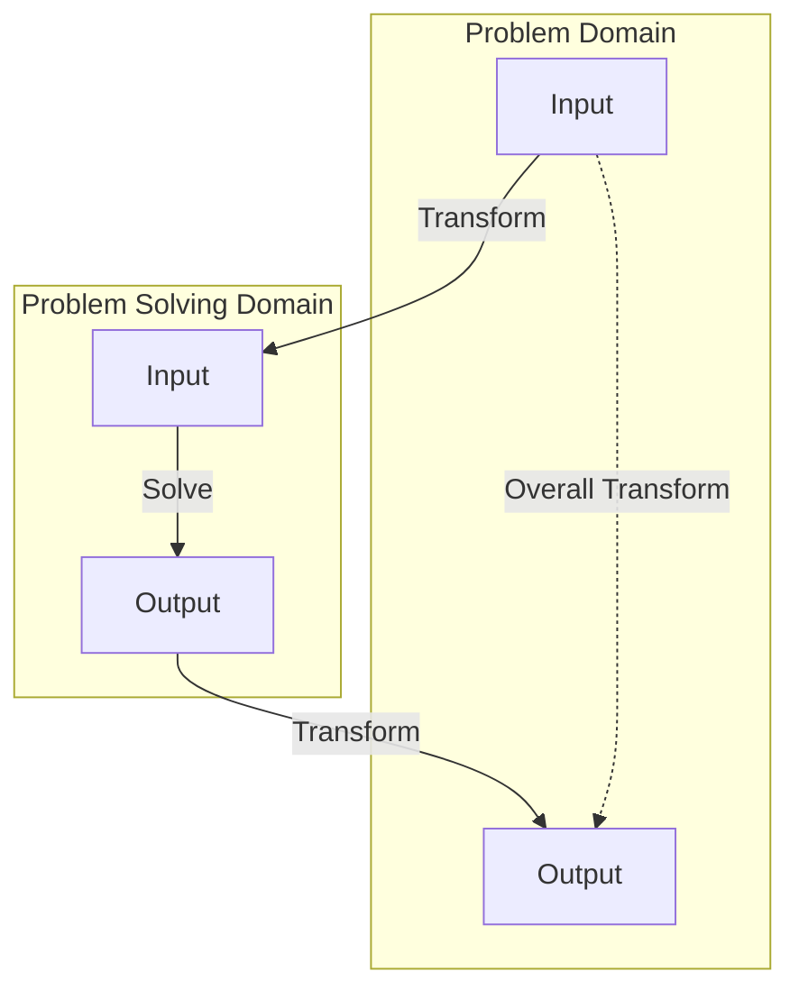
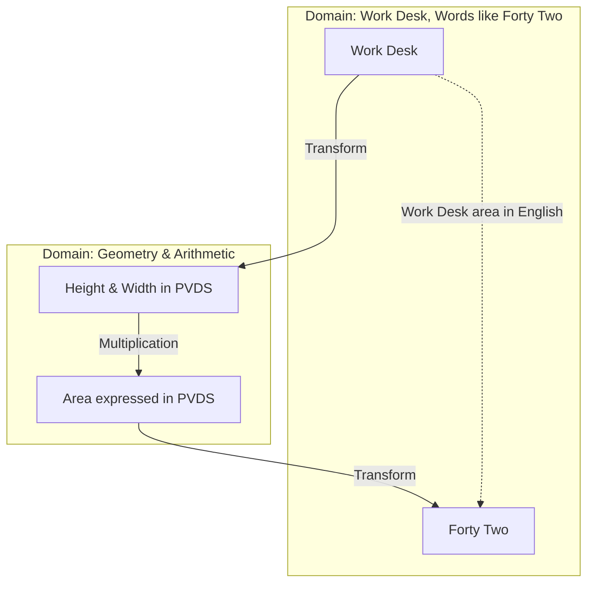
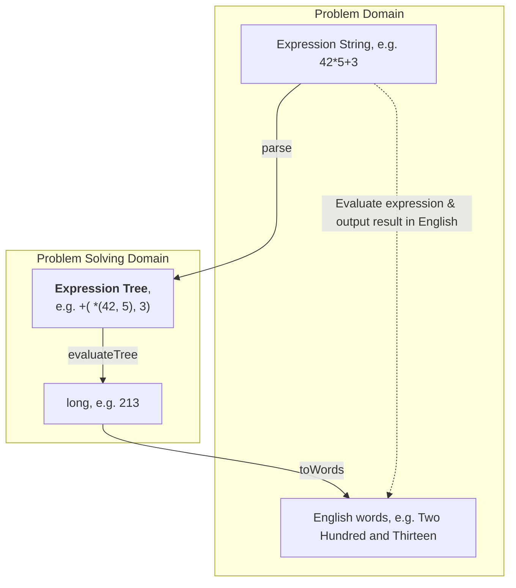
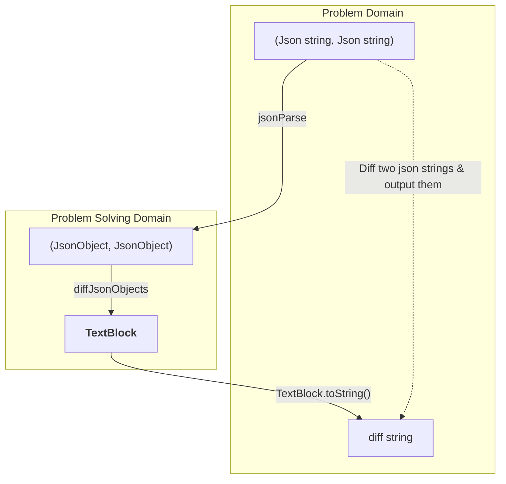
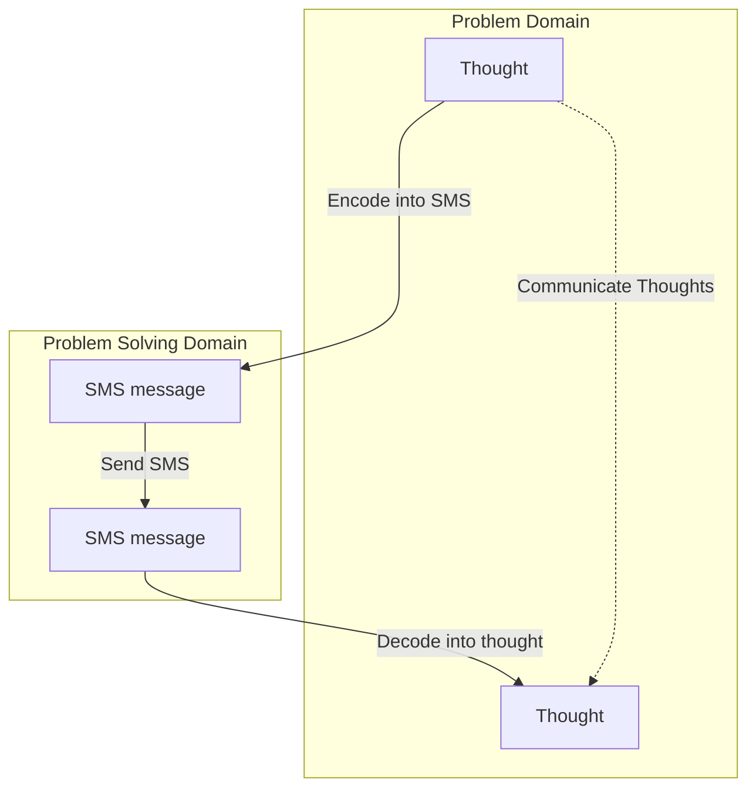
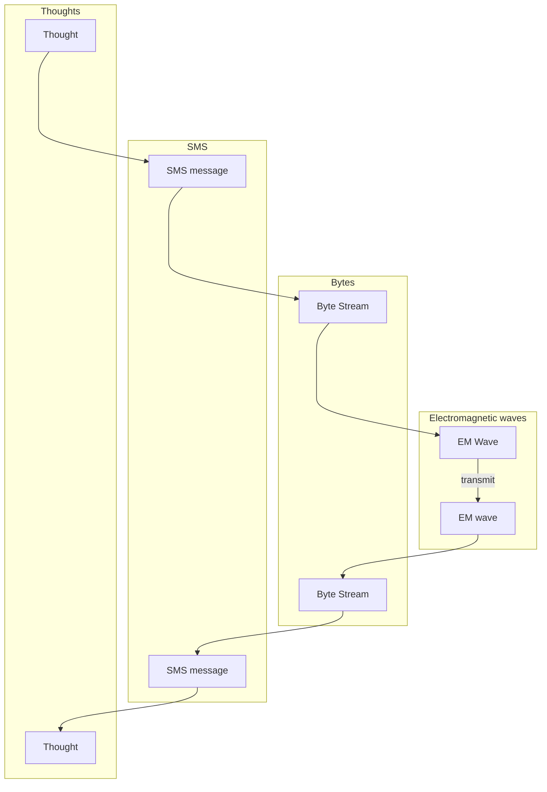
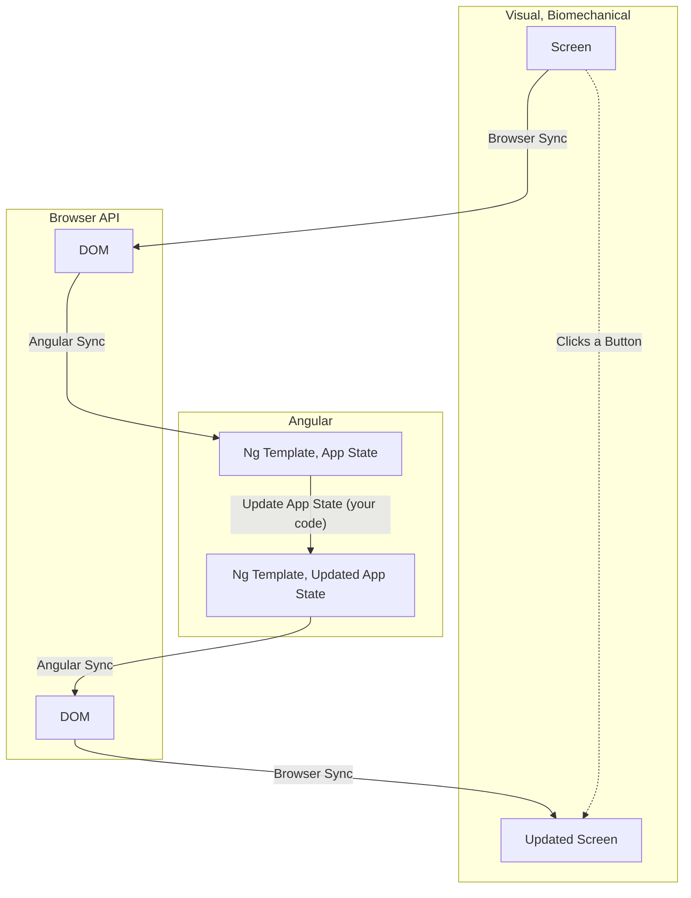

# Problem Statement

A compiler catches errors and more importantly guides us towards syntactically valid programs. Is there a similar guide for thinking about programs & programming? Some thing/process that can help us design systems & program them better ?

## A thought experiment example

Ultimately, programs transform inputs to outputs. Those inputs and outputs have some meaning to humans. Such transforms are common even outside programming; that is, in the real world. We don't think twice when performing such transforms, but we can learn something by examining one such example in depth.

> Problem `Work Desk Area in English`: Calculate the surface area of your work desk and express it in words, like `Forty Two` or `Sixteen`.
{:.block-warning}

Your solution likely goes like this:
1. Model the work desk as a rectangle.
1. Measure the lengths of sides of the desk and consider them to be the rectangle's dimensions
  * Capture the dimensions in `PVDS` (Place Value Decimal System). Other systems would be possible, for example, binary.
1. Compute the area using Rectangle's area formula.
  * Perform a multiplication of the dimensions in PVDS using some multiplication algorithm
  * The area is now available in PVDS
1. Take the area in PVDS and announce it in words

We can even **generalize** the solution approach.



In the `Work Desk area in English`, the Problem Solving Domain (i.e. the abstract world) is Geometry & Arithmetic.


> We can **generalize a pattern of problem solving** from the thought experiment:
> * To solve a problem, we need to utilize general tools (like geometry, arithmetic)
>   * **The tools are abstract, human-invented things and only work with human-invented concepts**
>   * For example, numbers, place value decimal systems, rectangles, multiplication are all abstract concepts/tools
> * There's an abstraction corresponding to Input & Output within each of the two domains, Problem domain & Problem solving domain
>   * In the **Problem domain**, the Input is the Work Desk and the output is English words
>   * In the **Problem Solving domain**, Input is length & breadth of a rectangle (in PVDS) and the output is an Area (in PVDS)
> * To solve the problem, the following steps are followed
>   * Input from Problem Domain is converted to Input in Problem Solving Domain
>   * The problem is solved in the Problem solving domain
>     * The `Work Desk Area` problem is solved by multiplying the length & breadth
>   * Output from Problem Solving Domain is converted to Output in Problem Domain
{:.block-tip}

## ABIYZ pattern

Let's name this pattern of problem solving since we'll refer to it later. Let's call it ABIYZ (for reasons not explained here).

> Good scientific laws lead to inferring other scientific laws. For example, Ole Roemer inferred that light had finite speed. He deduced this from the observations that eclipses occur at different times than predicted based on Earth's distance to Jupiter. He held that planetary laws were immutable and looked for a different explanation of the observations.

Similar to Roemer's method, we too would like to hold some tenets of software engineering as immutable so that we can discover others when something doesn't quite make sense. What are those tenets? Just like the compiler only allows syntactically valid programs, these tenets should lead to clean, explainable programs. 

I've been using ABIYZ as one of those immutable tenets and my experience has been very pleasant. It has helped me in designing clearly and avoiding sphagetti mess in code. I have also found it helpful to understand large frameworks.

# Relevance for Software Engineering

In the Work Desk example, we used a Problem Solving Domain already available for us (arithmetic, geometry) where as **in programming, we need to invent the Domain and the tools ourself**.

> Good software engineering requires inventing the concept of Place Value Decimal System and the Multiplication algorithm to solve the Work Desk Area problem. Numbers and arithmetic is a good problem solving domain for the area problem.
{:.block-tip}

Different problems will require different domains. Let's see some examples.

<hr>

## Example 1

Let's consider implementing the `eval` function.

Type | Description
---| ---
Input| An expression String, like `(42 * 5) + 3`
Output| The evaluation result, in words
Function signature| `String eval(String expression)`
Example | `eval("(42 * 5) + 3")` returns `"Two Hundred And Thirteen"`

<br>
To use the ABIYZ pattern,we need to answer a few questions:

Question | Answer
--- | ---
How's the input modeled in the PSD (Problem Solving Domain) ? | Expression Tree
How's the output modeled in the PSD? | `long`
How is "Solve" modeled in PSD? | `evaluateTree` function
What transforms the Input to PSD from PD? | `parse` function
What transforms the Output to PD from PSD? | `toWords` function

<br>



<hr>
Once the ABIYZ questions are answered, we can model the classes & implement the functions:
* Classes
  * `ExpressionTree`
* Functions
  * `ExpressionTree parse(String input)`
  * `long evaluateTree(ExpressionTree exprTree)`
  * `String toWords(long value)`

The `ExpressionTree` class is straightforward
```java
// An ExpressionTree is either of
// Addition, Multiplication or just a Number.
sealed interface ExpressionTree {
  record Addition(Expression left, Expression right) implements Expression {}
  record Multiplication(Expression left, Expression right) implements Expression {}
  record Number(long value) implements Expression {}
}
```

The overall `eval` function is trivial:
```java
String eval(String expression) {
  return toWords(evaluateTree(parse(expression));
}
```

The other functions are straightforward too (use any parser combinator or grammar tools for `parse` function) and we won't implement them here.

**KEY IDEAS**
* Asking the ABIYZ pattern questions can shed insights on how we think about the problem
* We invented new concepts (`ExpressionTree`) to simplify solving the problem
* As a bonus, the solution is clean and can be reused effectively. For example, many pieces can be reused for variations of the original problem:
  * Instead of outputting English Words, output Spanish words
    * Change the `toWords` function to `toSpanishWords`, `toEnglishWords` etc. Other functions don't need to change
  * Instead of accepting a String expression, accept a visual input (i.e. need OCR)
    * Change the `parse` function to `parseOCR`. Other functions don't need to change

<hr>
## Example 2

For this example, we'll diff two json documents, the `jsonDiff` function.

Type | Description
---| ---
Input| Two Json Strings
Output| A String capturing the diff result (see below)
Function signature| `String jsonDiff(String leftJson, String rightJson)`

```
// Diff output format

leftJson = {
    equal: 42
    unequal: 1
    leftOnly: "abc"
    child: {
        equal: 42
        leftOnly: "abc"
    }
    equalChild: {
        a: 1
        b: "bcd"
    }
    longString: "aaaaaaaaaaaaaaaaaaaaaaaaaaaaaaaaaaaaaaaaaaaaaaaaaaaaaa"
}

rightJson = {
    equal: 42
    unequal: 2
    rightOnly: "xyz"    
    child: {
        equal: 42
        rightOnly: "xyz"
    }
    equalChild: {
        a: 1
        b: "bcd"
    }
}

jsonDiff(leftJson, rightJson) returns the following diff output:

!=  ROOT                                                                                        |
  ==  equal                        42                                                           |
  !=  unequal                      1                            | 2                             |
  !=  leftOnly                     "abc"                        | <null>                        |
  !=  rightOnly                    <null>                       | "xyz"                         |
  !=  longString                   "aaaaaaaaaaaaaaaaaaaaaaaaaaa | <null>                        |
                                   aaaaaaaaaaaaaaaaaaaaaaaaaaa" |                               |
  ==  equalChild                   {                                                            |
                                       a: 1                                                     |
                                       b: "bcd"                                                 |
                                   }                                                            |
  !=  child                                                                                     |
    ==  equal                      42                           |                               |
    !=  leftOnly                   "abc"                        |  <null>                       |
    !=  rightOnly                  <null>                       |  "xyz"                        |
```

For simplicity of exposition, let's ignore List typed members of the Json (they don't change the story).

The rules of the diff strings are:
* There are 4 columns of the output, each of a fixed width.
  * Indicator, like `==` or `!=`
  * Property name, indented, like `ROOT.child.leftOnly`
  * Property value on the left side; displayed when there's a diff
  * Property value on the right side; displayed when there's a diff
  * Special case: When property values on both sides are equal, display it after merging the columns of the left & right sides
  * Special note: There's a separator `|` between left and right side columns unless they are merged.
* Each property will have one horizontal entry (it could span multiple lines like `equalChild`)
* Equal properties have their values displayed. E.g. `equalChild` and `equal` properties
* Inequal properties have both sided values displayed. E.g. `unequal`
* Properties that occur on only one side should have their values displayed. E.g. `leftOnly` & `rightOnly`. The special `<null>` indicates lack of value for the property. For example, there's no property named `leftOnly` on the right side

<br>
To use the ABIYZ pattern,we need to answer a few questions:

Question | Answer
--- | ---
How's input json modeled in the PSD (Problem Solving Domain) ? | Using `JsonObject`
How's the output modeled in the PSD? | `TextBlock`
How is "solve" modeled in PSD? | `diffJsonObjects` function
What transforms the Input to PSD from PD? | `jsonParse` function
What transforms the Output to PD from PSD? | `TextBlock.toString()` method



We've just invented two concepts that we expect will make it easier to solve the problem: `JsonObject` & `TextBlock`. How do we go about defining them more clearly? We make a few observations:
* `JsonObject` should have at least as much information as the input json strings
* `TextBlock` should have at least as much information as the final diff string

What about the operations on these concepts? We make a few more clarifications:
* We create a different class for each of these concepts. Lets call them by the same name; so, we have two classes `JsonObject` and `TextBlock`
* The Operations on our Concepts translate to methods on our Classes.
* The operations are guided by how `diffJsonObjects` will utilize these concepts.
  * In other words, we are designing the tools (the methods) so that we can utilize them to help solve the problem easier.

This gives us an outline already.
```java
sealed interface JsonObject {

  // A Json value which happens to be another json
  record JsonStruct(Map<String, JsonObject> children) implements JsonObject {
    // Obtain the value of a given property, if it exists
    Optional<JsonObject> getValue(String propertyName) {...}

    // When we compute the diff, we need to inspect every property
    Iterable<Map.Entry<String, JsonObject>> allChildren() {...}
  }

  // A Json value which happens to be just an integer
  record JsonInteger(long value) implements JsonObject {}

  // A Json value which happens to be just a string
  record JsonString(String value) implements JsonObject {}
}
```
Note how JsonStruct has methods that are used by `diffJsonObjects`.
<br>

Now, let's turn to `TextBlock`, which models the output diff string. Since it should capture the diff string, its structure should perhaps reflect the composition of the diff string. In other words, if we can express the diff string as being composed out of smaller individual units, we will have modeled `TextBlock`.

In this image, we can see that the overall diff is composed out of a stack of vertical blocks



Each of those vertical blocks is composed out of horizontal blocks


There's recursive structure here & we won't go into full details but we are now ready to model the `TextBlock`.
* A `TextBlock` is a rectangular block of text
* Two `TextBlock`s can be combined either horizontally or vertically.

That's all we need to produce the diff string. So, we can now convert it into a simple class definition & operations

```java
interface TextBlock {
  int height();
  int width();
  // Returns the list of lines that this TextBlock consists of
  // There will be #height() such returned lines
  // The size of each line will be #width() characters long
  List<String> content();
}

final class TextBlockOperations {
  // Appends two TextBlocks side by side and returns this newly appended one.
  // Their top edges will be aligned.
  // If their bottom edges don't align, the shorter one will grow downwards to align
  TextBlock appendHorizontal(TextBlock left, TextBlock right);

  // Appends two TextBlocks top to bottom and returns this newly appended one.
  // Their left edges will be aligned.
  // If their right edges don't align, the shorter one will grown to the right to align
  TextBlock appendVertical(TextBlock top, TextBlock bottom);

  // Returns a TextBlock with the specified width and the specified content.
  // If the content is shorter than width, spaces are used to pad it to 'width'.
  // If content is larger than width, the TextBlock will keep gaining new height
  // to accommodate all of the content while never exceeding the width.
  // So, for width = 3, content = abcdefg, the returned TextBlock will look like
  // (excluding the enclosing | characters)
  // |abc|
  // |def|
  // |g  |
  TextBlock create(String content, int width);
}
```

It is straightforward to implement all the relevant functions. In particular, `diffJsonObjects` can construct the finall diff `TextBlock` by composing it step by step using the composition operations from `TextBlockOperations`.


This example demonstrates how asking simple questions in the ABIYZ pattern enables us to write clean, modular, functional code. The fact that each of these concepts has its own classes means we can test them independently. For example, whether a TextBlock is implemented correctly has nothing to do with what it is used for (like the diffing here). In other words, the ABIYZ pattern encourages defining independent concepts which can then be tested separately.

## Example 3

Consider a person communicating their thoughts with another person via text messaging. There's ABIYZ hidden here too:



In fact, we can drill down into this example and ask: `how are SMS getting transmitted?`. We can again use ABIYZ to reason about it, recursively. SMS are transformed into a Stream of Bytes which are sent across the network. Again, we can ask, `how are those bytes transferred?` and so on so forth until we get all the way down to transistors, then atoms, then subatomic particles etc.



## Example 4

ABIYZ also helps us understand software better. For example understanding frontend frameworks like Angular ([documentation](https://angular.io/docs)) for a beginner can be difficult. But, it can help to think in ABIYZ terms.

Consider a website that shows a social media feed. The user sees some pixels corresponding to their social media feed. As the feed changes, the pixels change. Similarly, as the user interacts with the UI(filters/clicks etc), the feed changes. Angular aims to help manage this ping-pong. Looking at the Angular docs can be intimidating, but we can try to understand it better by asking the standard ABIYZ questions: what is the Problem Domain, the Problem Solving Domain and their corresponding concepts & operations?

Pretty soon, we get to the ABIYZ graph for a Button Click action. That is, when a user clicks a button, we want to update the UI in response. Typically, this will include fetching new data and/or changing the screen data/layout in response to the newly fetched data.


Angular becomes easier to understand & retain once we understand the different domains (User's senses, Browser API, Angular. Angular simply models the DOM as a combination of a template with blanks filled from Application State (fancily called `data binding`). Your code to respond to the button then just needs to update the Application State and Angular is responsible for syncing it to the DOM. Of course, there is a LOT more to Angular than this, but asking ABIYZ questions provides a good start for understanding it more comprehensively.

# Summary

> The purpose of abstraction is not to be vague, but to create a new semantic level in which one can be absolutely precise. - Dijkstra

Perhaps the spirit of the ABIYZ pattern is succinctly captured by the Dijkstra quote. It encourages thinking in terms of different domains. Each domain has its own set of concepts and tools. **We solve problems of one domain by modeling them as problems in another domain** where they are more readily solvable. For a SWE, the challenge is to identify and create these domains in service of the problem at hand. The `diffJsonObjects` example demonstrated this thought process.

To conclude, ABIYZ pattern of problem solving is a useful thought tool that can simplify designing clean, well-factored, well-tested programs for certain classes of programs. It is likely that software engineers are doing this very particular thing, but in an intuitive way when designing programs/systems. ABIYZ formalizes it so that we can approach even difficult problems logically.
